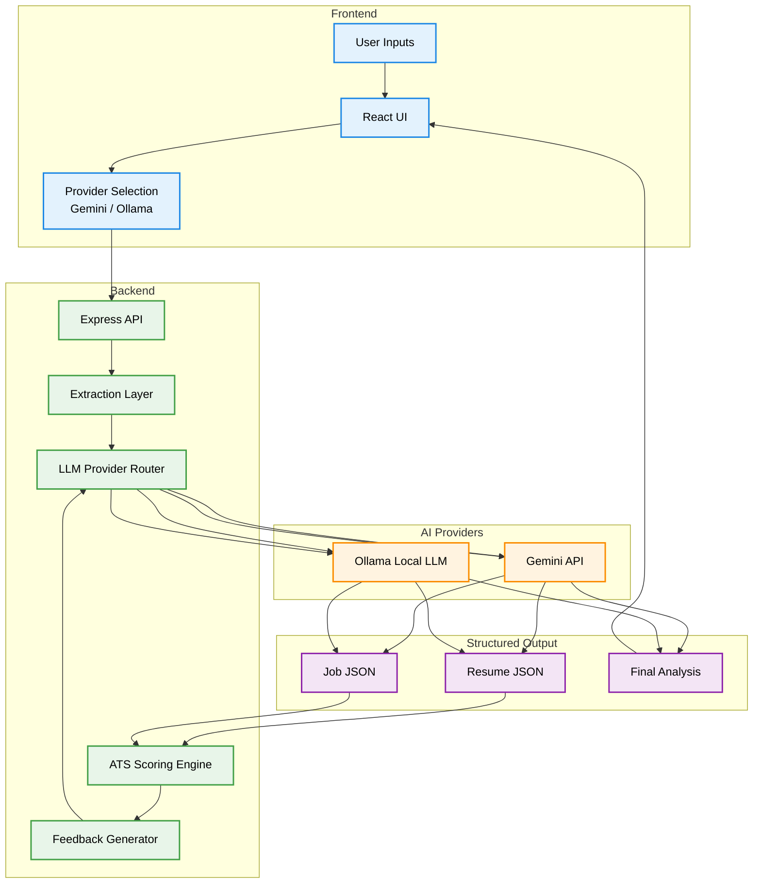

## Implemented AI Pipeline Architecture

```mermaid
flowchart TB

    %% FRONTEND

    subgraph FRONTEND["Frontend"]
        A["User Inputs"]
        B["React UI"]
        C["Provider Selection<br/>Gemini / Ollama"]
    end

    %% BACKEND

    subgraph BACKEND["Backend"]
        D["Express API"]

        E["Extraction Layer"]

        F["LLM Provider Router"]

        G["ATS Scoring Engine"]

        H["Feedback Generator"]
    end

    %% AI PROVIDERS

    subgraph AI["AI Providers"]
        I["Gemini API"]
        J["Ollama Local LLM"]
    end

    %% DATA

    subgraph DATA["Structured Output"]
        K["Resume JSON"]
        L["Job JSON"]
        M["Final Analysis"]
    end

    %% FLOW

    A --> B
    B --> C
    C --> D

    D --> E
    E --> F

    F --> I
    F --> J

    I --> K
    I --> L

    J --> K
    J --> L

    K --> G
    L --> G

    G --> H

    H --> F

    F --> I
    F --> J

    I --> M
    J --> M

    M --> B

    %% STYLING

    classDef frontend fill:#E3F2FD,stroke:#1E88E5,stroke-width:2px,color:#000;
    classDef backend fill:#E8F5E9,stroke:#43A047,stroke-width:2px,color:#000;
    classDef ai fill:#FFF3E0,stroke:#FB8C00,stroke-width:2px,color:#000;
    classDef data fill:#F3E5F5,stroke:#8E24AA,stroke-width:2px,color:#000;

    class A,B,C frontend;
    class D,E,F,G,H backend;
    class I,J ai;
    class K,L,M data;
```
