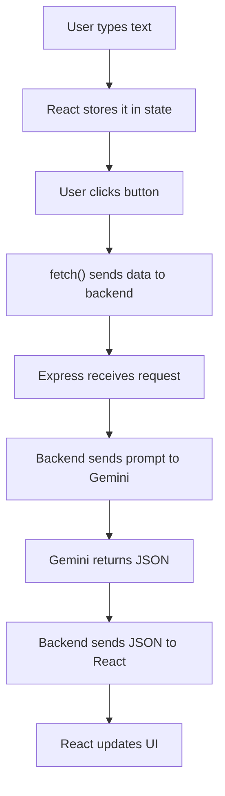

```mermaid
flowchart TD
    n1["User types text"] --> n2["React stores it in state"]
    n2 --> n3["User clicks button"]
    n3 --> n4["fetch() sends data to backend"]
    n4 --> n5["Express receives request"]
    n5 --> n6["Backend sends prompt to Gemini"]
    n6 --> n7["Gemini returns JSON"]
    n7 --> n8["Backend sends JSON to React"]
    n8 --> n9["React updates UI"]
```
