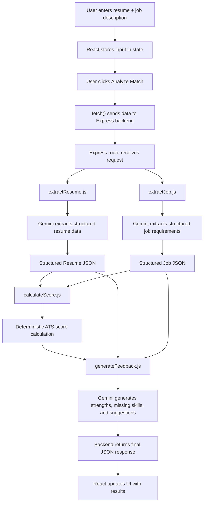

```mermaid
flowchart TD

    A["User enters resume + job description"]
        --> B["React stores input in state"]

    B --> C["User clicks Analyze Match"]

    C --> D["fetch() sends data to Express backend"]

    D --> E["Express route receives request"]

    E --> F["extractResume.js"]
    E --> G["extractJob.js"]

    F --> H["Gemini extracts structured resume data"]
    G --> I["Gemini extracts structured job requirements"]

    H --> J["Structured Resume JSON"]
    I --> K["Structured Job JSON"]

    J --> L["calculateScore.js"]
    K --> L

    L --> M["Deterministic ATS score calculation"]

    M --> N["generateFeedback.js"]

    J --> N
    K --> N

    N --> O["Gemini generates strengths, missing skills, and suggestions"]

    O --> P["Backend returns final JSON response"]

    P --> Q["React updates UI with results"]
```
