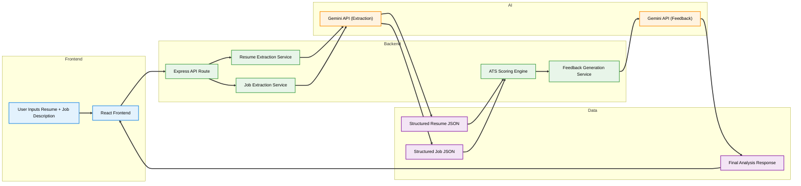

## Planned AI Pipeline Architecture

```mermaid
flowchart LR

    subgraph Frontend
        A["User Inputs Resume + Job Description"]
        B["React Frontend"]
    end

    subgraph Backend
        C["Express API Route"]

        D["Resume Extraction Service"]
        E["Job Extraction Service"]

        F["ATS Scoring Engine"]

        G["Feedback Generation Service"]
    end

    subgraph AI
        H["Gemini API (Extraction)"]
        L["Gemini API (Feedback)"]
    end

    subgraph Data
        I["Structured Resume JSON"]
        J["Structured Job JSON"]
        K["Final Analysis Response"]
    end

    A --> B
    B --> C

    C --> D
    C --> E

    D --> H
    E --> H

    H --> I
    H --> J

    I --> F
    J --> F

    F --> G

    G --> L

    L --> K

    K --> B

    %% Link Styling
    linkStyle default stroke-width:3px;

    %% Node Styling
    classDef frontend fill:#E3F2FD,stroke:#1E88E5,color:#000,stroke-width:2px;
    classDef backend fill:#E8F5E9,stroke:#43A047,color:#000,stroke-width:2px;
    classDef ai fill:#FFF3E0,stroke:#FB8C00,color:#000,stroke-width:2px;
    classDef data fill:#F3E5F5,stroke:#8E24AA,color:#000,stroke-width:2px;

    class A,B frontend;
    class C,D,E,F,G backend;
    class H,L ai;
    class I,J,K data;
```
