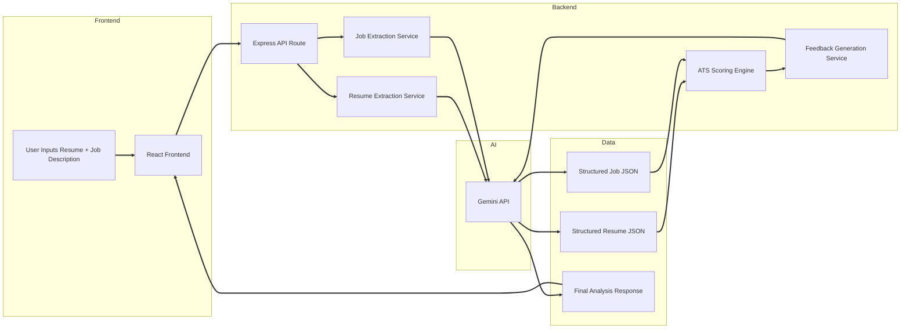

## Planned AI Pipeline Architecture

```mermaid
flowchart LR

    subgraph Frontend
        A["User Inputs Resume + Job Description"]
        B["React Frontend"]
    end

    subgraph Backend
        C["Express API Route"]

        D["Resume Extraction Service"]
        E["Job Extraction Service"]

        F["ATS Scoring Engine"]

        G["Feedback Generation Service"]
    end

    subgraph AI
        H["Gemini API"]
    end

    subgraph Data
        I["Structured Resume JSON"]
        J["Structured Job JSON"]
        K["Final Analysis Response"]
    end

    A -->| | B
    B -->| | C

    C -->| | D
    C -->| | E

    D -->| | H
    E -->| | H

    H -->| | I
    H -->| | J

    I -->| | F
    J -->| | F

    F -->| | G

    G -->| | H

    H -->| | K

    K -->| | B

    linkStyle default stroke-width:3px;

    classDef nodePadding padding:15px;
    class A,B,C,D,E,F,G,H,I,J,K nodePadding;
```
